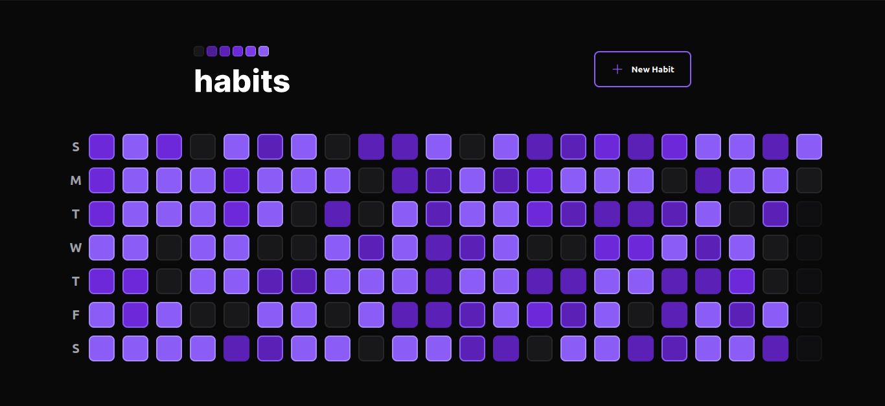

# Habit Tracker

The idea of this project is to track your daily habits and show it in a heatmap format.



You can add new habits as you want to. But by default, it will only show starting on the day you created.


Then you can check those habits that you have done in that day.


## Table of Contents

- [Setup](#setup)
- [Run](#run)
  - [Backend](#backend)
  - [Frontend](#frontend)
- [Seeding](#seeding)
- [Testing](#testing)

## Setup

1. Install [Docker.](https://docs.docker.com/engine/install/)
2. Install [Node.](https://nodejs.org/en/download)
3. Install [Yarn.](https://classic.yarnpkg.com/lang/en/docs/install/#debian-stable)
4. Setup .env file base on the [env.example](./.env.example) file.
5. Setup .env frontend file based on the [frontend/.env.example](./frontend/.env.example) file.

## Run

### Backend

The backend run as default on port **8000**.

```sh
    docker compose up
```

### Frontend

The frontend run as default on port **5173**.

```sh
    cd frontend
    yarn
    yarn dev
```

## Seeding

In order to seed the database with some initial data, you can use the seed's file in the [seeds](./backend/seeds) folder.

In order to run the seeds:

1. Start the backend server

```sh
    docker compose up
```

2. Run the **loaddata** django command inside the container:

```sh
docker exec habit-tracker-api-1 python3 manage.py loaddata ./seeds/habits.json

docker exec habit-tracker-api-1 python3 manage.py loaddata ./seeds/days.json

```

## Testing

Django will create a separated database only for tests and it is totally responsible for creating that and destroying it afterwards.

You can run the backend tests by running:

```sh
    docker exec habit-tracker-api-1 python3 manage.py test
```
